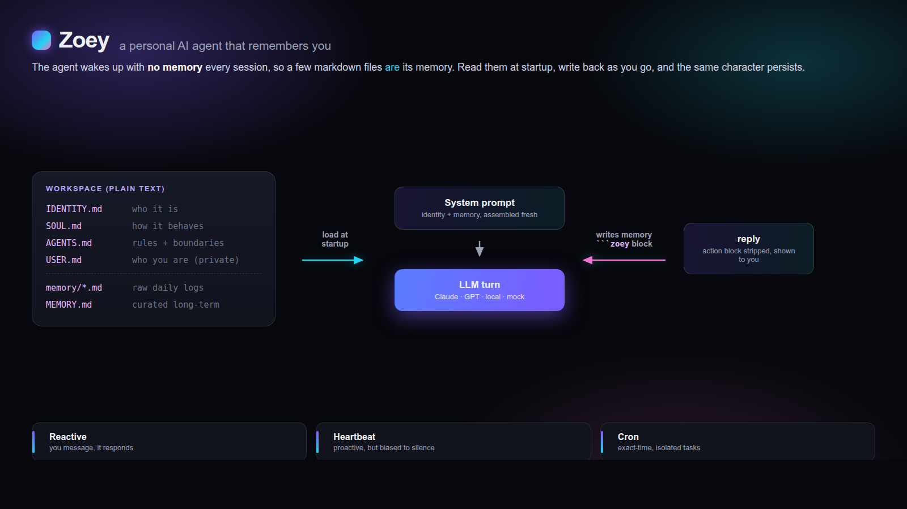

<div align="center">

# 🪼 Zoey

### A personal AI agent that actually *remembers* you — in ~600 lines, zero dependencies.

Stable identity. Persistent, file-based memory. Proactive, but not annoying.
Clone it, add a key (or use your local `claude`), and talk to it. It remembers across runs.

[Quickstart](#quickstart) · [Architecture](docs/architecture.md) · [Memory model](docs/memory-model.md) · [Heartbeat loop](docs/heartbeat-loop.md) · [Live site](https://FERBIN12.github.io/zoey/)

<br>



</div>

---

## What this is

Most AI assistants forget you the moment the chat ends. **Zoey** is a tiny, runnable
reference implementation of a personal agent that doesn't — a consistent personality, a
memory that survives restarts, and the judgment to reach out on its own without spamming you.

It's deliberately small and **dependency-free** (pure Python stdlib) so you can read the
whole thing, understand exactly how a persistent agent works, and fork it into your own.

```
zoey/            the runtime (read it — it's short)
  agent.py       the loop: assemble prompt → call LLM → persist memory
  prompt.py      the startup algorithm (which files load, in what order)
  memory.py      two-tier file memory (daily logs + curated MEMORY.md)
  actions.py     how the agent edits its own memory (the ```zoey protocol)
  providers.py   Anthropic / OpenAI / local claude / offline mock — raw HTTP
  workspace.py   the markdown files that *are* the agent's mind
agent/           the workspace template (IDENTITY/SOUL/USER/AGENTS/…)
docs/            the architecture, memory model, and heartbeat loop explained
```

## The idea in one sentence

> The agent wakes up with no memory every session — so a few markdown files **are** its memory.
> Read them at startup, update them as you go, and the same character persists indefinitely.

No vector database. No fine-tuning. Continuity is just **files re-read on every wake-up**, which
makes the agent's entire mind auditable, forkable, and editable in a text editor.

## Quickstart

```bash
git clone https://github.com/FERBIN12/zoey.git
cd zoey
pip install -e .            # zero dependencies; installs the `zoey` command

# pick how it thinks (any one of these):
export ANTHROPIC_API_KEY=sk-ant-...    # ZOEY_PROVIDER=anthropic (default)
#   ...or ZOEY_PROVIDER=openai with OPENAI_API_KEY
#   ...or ZOEY_PROVIDER=claude-cli      (no key — uses your local `claude`)
#   ...or ZOEY_PROVIDER=mock            (no key, offline — try the loop instantly)

zoey init        # scaffold the workspace (~/.zoey/workspace)
zoey chat        # first run: it asks who it is and who you are, then remembers
```

Tell it something, quit, run `zoey chat` again tomorrow — it remembers. That's the whole point.

```
zoey init        scaffold the workspace from the template
zoey chat        talk to your agent (bootstraps itself on first run)
zoey heartbeat   run one proactive check-in (wire to cron for real proactivity)
zoey doctor      show config + health
```

> **Try it with no setup:** `ZOEY_PROVIDER=mock zoey init && ZOEY_PROVIDER=mock zoey chat`
> exercises the full memory/bootstrap loop offline, so you can see the mechanics before adding a key.

## How it works

The runtime is small enough to read in one sitting. Three short docs explain the design:

1. **[Architecture](docs/architecture.md)** — the startup algorithm, the three input loops, the safety spine.
2. **[Memory model](docs/memory-model.md)** — two-tier memory, the consolidation loop, the privacy boundary.
3. **[Heartbeat loop](docs/heartbeat-loop.md)** — proactive without being annoying; heartbeat vs cron.

### Why it's interesting

- **🧠 Real continuity, zero infra.** Two-tier memory (raw daily logs → curated `MEMORY.md`). No embeddings.
- **✍️ The agent edits its own memory.** It emits a small [`zoey` action block](docs/architecture.md); the runtime executes it and strips it from the reply. Provider-agnostic, no function-calling API needed.
- **💓 Proactive, with restraint.** A [heartbeat](docs/heartbeat-loop.md) lets it reach out — but the default is silence.
- **🛡️ A safety spine.** Every action is *internal* (read/learn → bold) or *external* (post/email → ask first).
- **📄 Plain text all the way down.** Broke its personality? Edit the file. Roll it back with git.

## Configuration

All via environment variables (nothing secret is stored on disk):

| Var | Default | Meaning |
|-----|---------|---------|
| `ZOEY_PROVIDER` | `anthropic` | `anthropic` · `openai` · `claude-cli` · `mock` |
| `ZOEY_MODEL` | `claude-opus-4-8` | model id (e.g. `claude-haiku-4-5`, `gpt-4o`) |
| `ZOEY_WORKSPACE` | `~/.zoey/workspace` | where identity + memory live |
| `ZOEY_MAX_TOKENS` | `4096` | max reply length |

See [`.env.example`](.env.example).

## Privacy

`USER.md`, `TOOLS.md`, and `MEMORY.md` fill up with personal context as you use your agent.
The workspace lives outside the repo (`~/.zoey/`), and the included [`.gitignore`](.gitignore)
excludes memory, secrets, and credentials. `MEMORY.md` is loaded only in private main sessions —
that boundary is a security feature, not a style choice.

## Credit

Zoey distills the agent-workspace pattern popularized by [OpenClaw](https://github.com/openclaw/openclaw)
(MIT, by the OpenClaw Foundation) into a small, runnable, dependency-free reference you can read and fork.
If you want a batteries-included, multi-channel runtime to run this pattern in production, start there.

## License

[MIT](LICENSE) — do whatever you want, just keep the notice.
